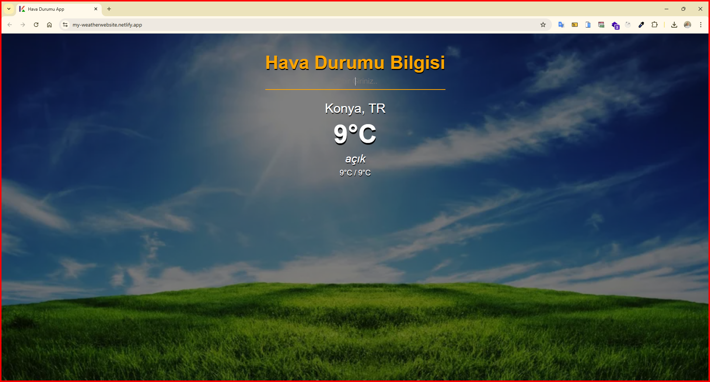
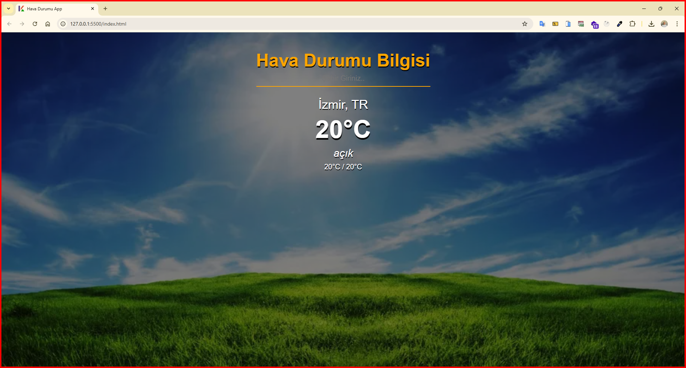

<h1>Hava Durumu Uygulaması</h1>

Geliştirdiğim hava durumu uygulamasında API aracılığıyla girilen şehrin anlık hava durumu bilgileri ekrana yansır.

<h2> Sitemin ön yüz geliştirme aşamasında aşağıdaki teknolojiler kullanıldı: </h2>

- HTML5
- CSS
- API

<h2> Hava Durumu Sitemi Ziyaret Edin </h2>

- https://my-weatherwebsite.netlify.app/

<h4>Fotoğraf</h4>

